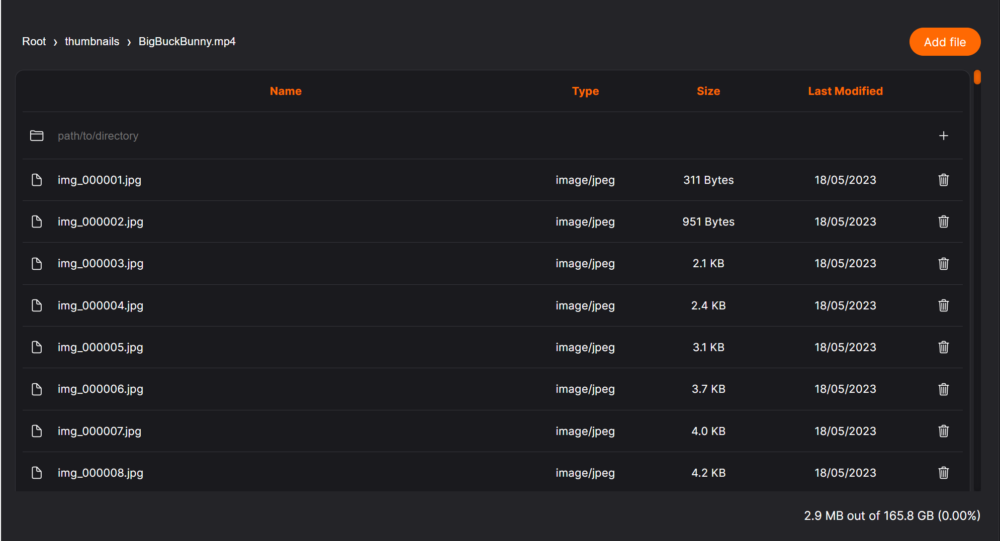

# OPFS Explorer

OPFS Explorer is a web component that can be embed in a web application to explorer the [Origin Private File System](https://developer.mozilla.org/en-US/docs/Web/API/File_System_Access_API#origin_private_file_system).



## Install

```sh
npm config set @mickaelvieira:registry https://npm.pkg.github.com
```

```sh
yarn add @mickaelvieira/opfs-explorer
```
or


```sh
npm -i @mickaelvieira/opfs-explorer
```

## Usage

Import the Web component in your script.

```ts
import '@mickaelvieira/opfs-explorer/index.js';
```

Add it to the DOM

```html
<opfs-explorer></opfs-explorer>
```

You can customize the styling.

```css
opfs-explorer {
  --opfs-font-family: Arial;
  --opfs-font-size: 0.8rem;
  --opfs-color-background: black;
  --opfs-color-border: gray;
  --opfs-color-primary: blue;
  --opfs-color-text: red;
  max-height: 200px;
}

opfs-explorer::part(breadcrumb) {
  display: none;
}

opfs-explorer::part(table) {
  border: 2px solid blue;
}

opfs-explorer::part(statistics) {
  display: none;
}
```

## Examples

```sh
yarn examples
```
